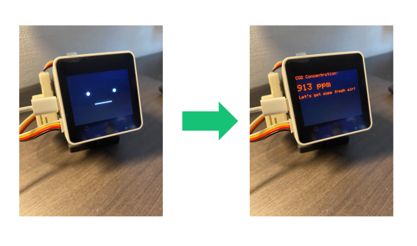

# M5StackChan_CO2Checker

M5stackでCO2濃度を測定し、一定値を超えたら部屋の換気を促してくれるロボット。

900ppmを超えると警告文を表示します。

---

### 必要な物 ###
* [M5Stack](http://www.m5stack.com/ "Title") (M5Stack Core2で動作確認。) 
* VSCode 
* PlatformIO 
* M5Stack用SCD40搭載CO2ユニット

使用しているライブラリ等は"platformio.ini"を参照。 